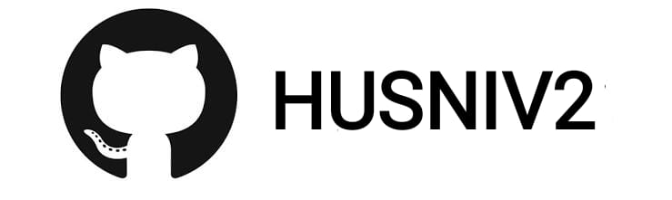

div align="center">

## [](https://git.io/typing-svg)


<div align="center">
  <a href="https://ibb.co/w0Q2QnG">
  <p align="center">
<a href="#"></a>
</p>
  </p>
<p align="center">
<a href="https://github.com/HUSNIV2"></a>

</div>
<p align="center">
Project created by <a href="https://github.com/HUSNIV2">husni</a> to make it public
    <br>
       | © |
        Reserved |
    <br> 
</p>

----

  <p align="center">
  <a href="https://github.com/HUSNIV2/HUSNI__V2 ">
    
<p align="center">
<a href="https://github.com/jinusirhttps://github.com/HUSNIV2/HUSNI__V2/edit/master/README.md1/followers"></a>
<a href="https://github.com/HUSNIV2/HUSNI__V2/stargazers/"></a>
<a href="https://github.com/HUSNIV2/HUSNI__V2/network/members"></a>
<a href="https://github.com/HUSNIV2/HUSNI__V2/watchers"></a>
<a href="#">


</p>
    
[](https://chat.whatsapp.com/JscI6briAP7KmxbZUW8ua7)

<h3 align="center">Contact Me:</h3>
<a href="https://instagram.com/_husni__jr_?utm_medium=copy_link" target="blank"></a>

</p>

<p align="center">husni official website:</h4>

<p align="center">

<a href="https://mubarakgaming.blogspot.com/" target="blank"></a>
```

HUSNI__V2 Userbot is Open Source software open to development. 
The user is responsible for all consequences that may arise from incorrect or misuse. 
Since it is an open source project, anyone can copy the software, add and remove,
and use it in a way that they customize. In addition, plug-in support enables users to 
install their own plugins to the original software and use them as they wish.
Using the bot out of purpose will explicitly ban you.
Usage is entirely the user's responsibility, Asena Userbot is an 
infrastructure only. Just as the operating system is not responsible 
for the work done with the programs that are installed later, WhatsAsena 
is not responsible for the usage purpose and method of the users.
Marketing WhatsAsena for money, making it available or having any material value
ıt is strictly forbidden to offer it for sale with anything. All legal investigations that may arise
the user is responsible.
```


## Setup
<div align="center">

  ### <u> Simple Method <u>
  
[](https://replit.com/@aju0011/Ajuserv2-Qr)

[](https://heroku.com/deploy?template=https://github.com/HUSNIV2/HUSNI__V2)
     </div>
<br>
<br >
If Repl.it not working Try Termux for Qr scanning.Just Copy the Link Below in Termux
```
bash <(curl -L https://t.ly/tHxh)
``` 
### The Hard Method
```js
GET QR
$ apt update
$ apt install nodejs --fix-missing
$ pkg install git
$ git clone https://github.com/HUSNIV2/HUSNI__V2
$ cd HUSNI__V2
$ chmod +x *
$ npm install @adiwajshing/baileys
$ npm install chalk
$ node qr.js
```
      
```js
SETUP
$ git clone https://github.com/HUSNIV2/HUSNI__V2
$ cd HUSNI__V2
$ chmod +x *
$ npm i
$ node qr.js
   // scan the qr using whatsapp web on your phone
$ node bot.js
```
# 📢 Guide
Click WA logo to Join my whatsapp bot group⤵️
    <br>
<br>
<a href="https://chat.whatsapp.com/JscI6briAP7KmxbZUW8ua7">

    

## F.A.Q
Answer a few frequently asked questions;
### Can you read my messages?
This project is open source so all the codes are clear. Neither less nor more; you can look what you want. **We absolutely do not have access to your accounts.**

### What about our security?
If you are concerned about security, you can install it on your own computer. If you think someone else has captured your data, simply click on **Whatsapp> Three Dots> Whatsapp Web> Logout** from all sessions button.

### Is it paid?
**Of course not.** It will never happen. But you can donate to us. You can reach me via [Telegram](https://t.me/fusuf) .

### ⚠️ Warning! 
```
Due to Userbot; Your WhatsApp account may be banned.
This is an open source project, you are responsible for everything you do. 
Absolutely, Asena executives do not accept responsibility.
By establishing the Asena, you are deemed to have accepted these responsibilities.
```
  
## Developers
  <div align="center">
    
  [HUSNI](Husni.jpg?size=100)](https://github.com/HUSNIV2)

[HUSNI](https://github.com/HUSNIV2)  
Base, Bug Fixed Modifiying  as   public | Bug Fixes, Modules
  </div>


## License
This project is protected by `GNU General Public Licence v3.0` license.

### Disclaimer
`WhatsApp` name, its variations and the logo are registered trademarks of Facebook. We have nothing to do with the registered trademark
